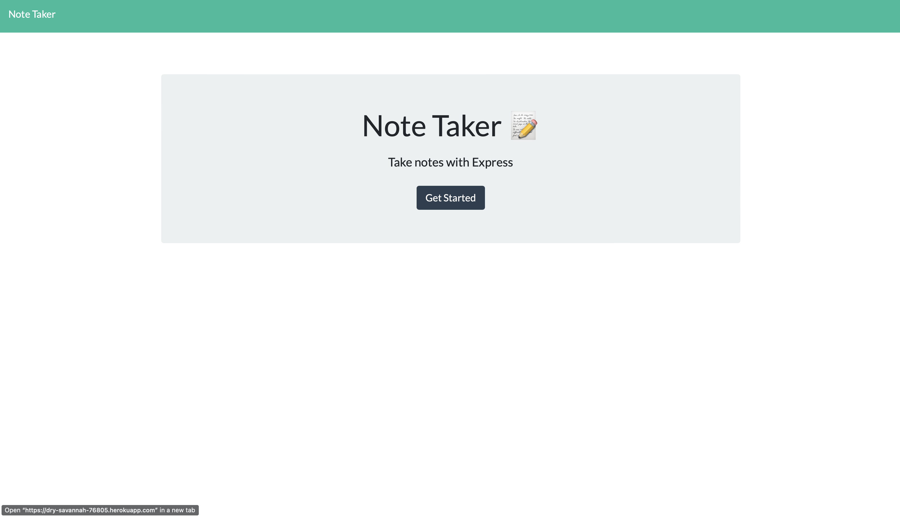
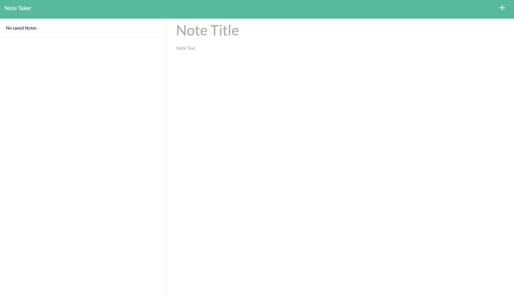

# week11-HW

# Links

[Heroku deployed app 💾](https://dry-savannah-76805.herokuapp.com)

# Table of Contents

- [Description](#description)
- [Installation](#Installation)
- [Usage](#Usage)
- [License](#License)
- [Contributing](#Contributing)
- [Tests](#Tests)
- [Questions](#Questions)

## Description

This app allows a manager to be able to view and manage the departments, roles, and employees in the company so that he can organize and plan my business.

## Installation

To run the app in the local server, clone the repository to your local memory follow the instructions below:

```
cd /week12-HW
npm install
npm start       <--- To run the app in a localhost
```

## Usage

```
Technologies used:
JavaScript - Node.js - Express.js - JSON - Heroku - Bootstrap

JS Modules:
Express.js - fs.module
```

- Below are screenshots of the deployed app in Heroku:
  

  

Functionality: - Allows user to take notes - See previous notes - Delete notes

# License

This project is not covered by a license.

## Contributing

No contribution

## Tests

No tests available for this task.

## Questions:

GitHub: https://github.com/frsargua

email: frsargua@gmail.com
